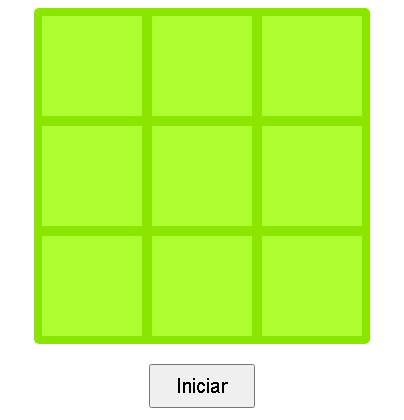

# jogo-da-velha

Implementação do jogo da velha 

<h3>Recursos</h3>
  <ul>
    <li>Recursos básicos que um jogo da velha tem</li>
    <li>Marca o jogador vencedor</li>
  </ul>
  
  <h3>Screenshot</h3>
    <h4 align="center">
      
    </h4>
    <h4 align="center">
      
    </h4>
    <h4 align="center">
      
    </h4>
